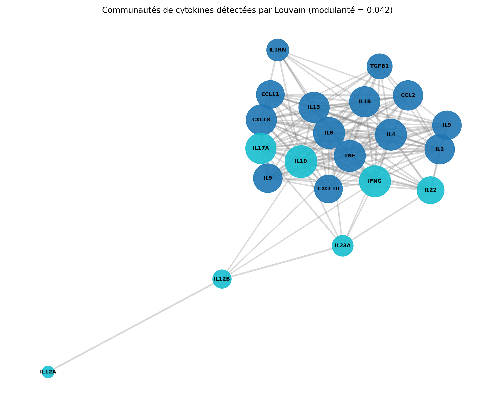
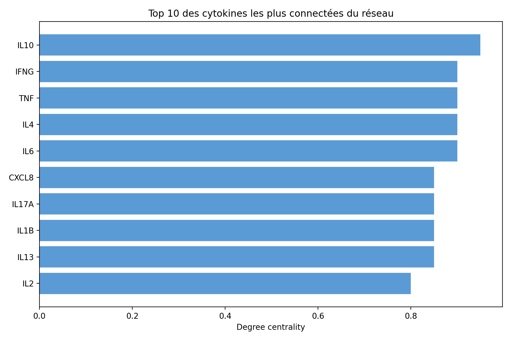

# Cytokine Interactome Analysis

Network analysis of 21 inflammatory cytokines using public data from **UniProtKB** and **STRING**. The project builds a protein–protein interaction network, identifies central cytokines, detects functional communities, and tests whether network structure relates to known drug targets and missing interactions.

No patient data is used: all data comes from public, open-access databases.



## Cytokine panel

The 21 cytokines cover the main functional families of the inflammatory response:

| Family | Cytokines |
| --- | --- |
| Pro-inflammatory | IL1B, IL6, TNF, CXCL8 |
| Anti-inflammatory / regulatory | IL10, TGFB1, IL1RN |
| Th1 response | IFNG, IL12A, IL12B, IL2 |
| Th2 response (allergy, asthma) | IL4, IL5, IL13, IL9 |
| Th17 response | IL17A, IL22, IL23A |
| Chemokines | CCL2, CCL11, CXCL10 |

## Pipeline

| Step | File | What it does |
| --- | --- | --- |
| 1 | `src/01_data_collection.py` | Downloads UniProt annotations, the STRING interaction network (confidence ≥ 0.7) and STRING functional enrichment |
| 2 | `notebooks/02_network_construction.ipynb` | Builds the network and computes degree, betweenness and eigenvector centrality |
| 3 | `notebooks/03_community_detection.ipynb` | Detects communities with the Louvain algorithm and interprets them biologically |
| 4 | `notebooks/04_threshold_sensitivity.ipynb` | Tests how the network changes with STRING thresholds from 400 to 900 |
| 5 | `notebooks/05_drug_target_validation.ipynb` | Tests whether central cytokines are enriched in known drug targets (hypergeometric test) |
| 6 | `notebooks/06_community_enrichment.ipynb` | Runs functional enrichment (GO, KEGG, Reactome) for each community |
| 7 | `notebooks/07_link_prediction.ipynb` | Predicts missing interactions (Jaccard, Adamic–Adar, common neighbors) and validates on held-out edges |

## How to run

```bash
git clone https://github.com/chahdnecib/cytokine-interactome-analysis.git
cd cytokine-interactome-analysis
pip install -r requirements.txt

# 1. Download the data (creates data/raw/, which is not stored in the repo)
python src/01_data_collection.py

# 2. Open the notebooks and run them in order (02 to 07)
jupyter notebook notebooks/
```

Run the scripts from the project root, and the notebooks from the `notebooks/` folder, since they use relative paths (`../data/`). An internet connection is needed for step 1 and for notebooks 04 and 06, which query the STRING API.

## Results

**Network.** At STRING confidence ≥ 0.7, the network has 21 nodes and 147 interactions (density 0.70). It is fully connected.

**Central cytokines.** IL10 has the highest degree centrality (0.95), followed by IFNG, TNF, IL4 and IL6 (0.90). TNF has the highest betweenness centrality (0.116), making it the main bridge between groups.



**Communities.** Louvain detects two communities (modularity 0.042):

- **Community 0 (14 cytokines):** pro-inflammatory, Th2 and chemokines (IL6, TNF, IL1B, IL4, IL13, IL5, IL9, CXCL8, CCL2, CCL11, CXCL10, IL2, TGFB1, IL1RN).
- **Community 1 (7 cytokines):** the Th1/Th17 axis (IFNG, IL12A, IL12B, IL23A, IL17A, IL22, IL10), enriched for the IL-23, IL-12 and IL-27 complexes.

**Threshold sensitivity.** Raising the threshold from 400 to 900 reduces edges from 190 to 101 and raises modularity from 0.018 to 0.091. The community structure stays weak at every threshold.

| Threshold | Edges | Density | Communities | Modularity |
| --- | --- | --- | --- | --- |
| 400 | 190 | 0.90 | 2 | 0.018 |
| 700 | 147 | 0.70 | 2 | 0.042 |
| 900 | 101 | 0.48 | 4 | 0.091 |

**Drug-target validation.** The most central cytokines contain slightly more known drug targets than expected by chance (7 found vs. 5.2 expected in the top 10), but the difference is not statistically significant (p = 0.12–0.54).

**Link prediction.** When 29 known interactions were hidden, they reached a mean rank of 20.8 out of 92 candidate pairs, compared with about 46 expected for random ranking. The top predicted pairs are saved in `data/processed/link_predictions_top15.csv`.

## Limitations

- The network is very dense, so communities are only weakly separated (modularity below 0.1). This is partly because STRING's "functional" network includes text mining, and cytokines are often mentioned together in the literature.
- The panel of 21 cytokines was selected manually, so results depend on this choice.
- The drug-target test has low statistical power with only 21 proteins.

## Future work

- Rebuild the network using only experimental and curated database evidence, and compare modularity.
- Expand the panel with cytokine receptors and first-neighbor interactors.
- Report link prediction performance with AUC.

## Data sources

- [UniProtKB](https://www.uniprot.org/) — protein annotations (reviewed human entries)
- [STRING](https://string-db.org/) — protein–protein interactions and functional enrichment (*Homo sapiens*, taxon 9606)

## Author

**Chahd Necib** — Master's in Information and Decision Systems, Badji Mokhtar University, Algeria