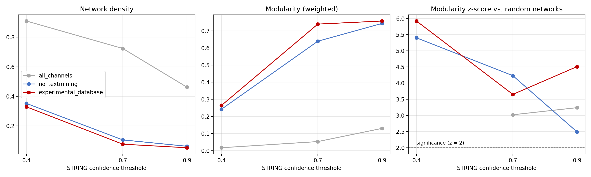
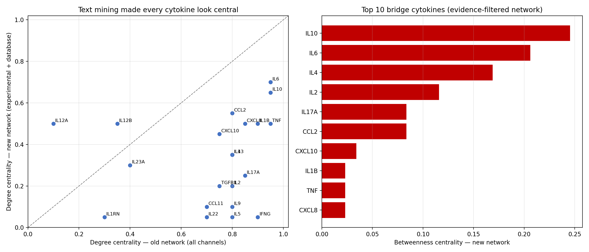
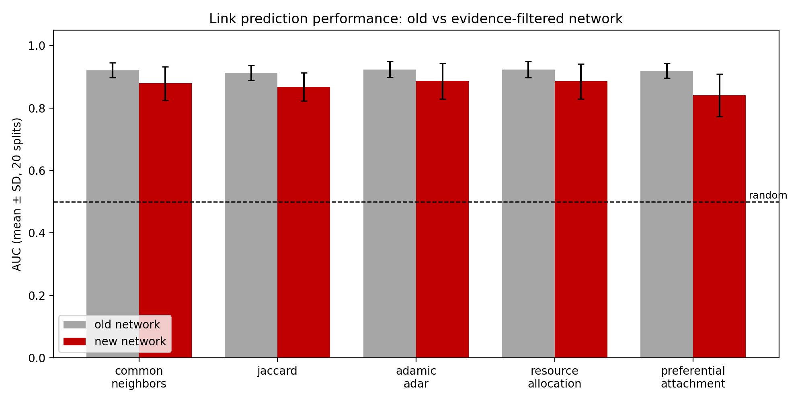
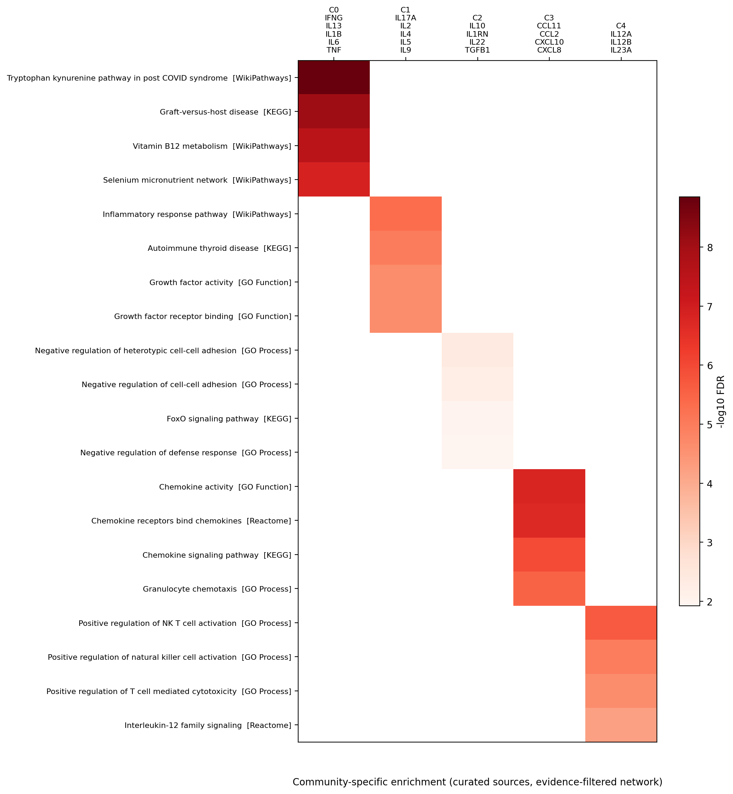

# Cytokine Interactome Analysis

Network analysis of 21 inflammatory cytokines using public data from **UniProtKB** and **STRING**. The project builds a protein–protein interaction network, identifies central cytokines, detects functional communities, and tests whether network structure relates to known drug targets and missing interactions.

No patient data is used: all data comes from public, open-access databases.


## Cytokine panel

The 21 cytokines cover the main functional families of the inflammatory response:

| Family | Cytokines |
| --- | --- |
| Pro-inflammatory | IL1B, IL6, TNF, CXCL8 |
| Anti-inflammatory / regulatory | IL10, TGFB1, IL1RN |
| Th1 response | IFNG, IL12A, IL12B, IL2 |
| Th2 response (allergy, asthma) | IL4, IL5, IL13, IL9 |
| Th17 response | IL17A, IL22, IL23A |
| Chemokines | CCL2, CCL11, CXCL10 |

## Pipeline

| Step | File | What it does |
| --- | --- | --- |
| 1 | `src/01_data_collection.py` | Downloads UniProt annotations, the STRING interaction network (confidence ≥ 0.7) and STRING functional enrichment |
| 2 | `notebooks/02_network_construction.ipynb` | Builds the network and computes degree, betweenness and eigenvector centrality |
| 3 | `notebooks/03_community_detection.ipynb` | Detects communities with the Louvain algorithm and interprets them biologically |
| 4 | `notebooks/04_threshold_sensitivity.ipynb` | Tests how the network changes with STRING thresholds from 400 to 900 |
| 5 | `notebooks/05_drug_target_validation.ipynb` | Tests whether central cytokines are enriched in known drug targets (hypergeometric test) |
| 6 | `notebooks/06_community_enrichment.ipynb` | Runs functional enrichment (GO, KEGG, Reactome) for each community |
| 7 | `notebooks/07_link_prediction.ipynb` | Predicts missing interactions (Jaccard, Adamic–Adar, common neighbors) and validates on held-out edges |
| 8 | `notebooks/08_evidence_filtered_network.ipynb` | Rebuilds the network without text mining, and tests community strength against 100 degree-preserving random networks |
| 9 | `notebooks/09_rerun_on_filtered_network.ipynb` | Reruns centrality, drug-target validation and link prediction (AUC over 20 splits) on the filtered network |
| 10 | `notebooks/10_specific_enrichment.ipynb` | Checks the IL12A mapping, and finds community-specific enrichment using curated sources only |

## How to run

```bash
git clone https://github.com/chahdnecib/cytokine-interactome-analysis.git
cd cytokine-interactome-analysis
pip install -r requirements.txt

# 1. Download the data (creates data/raw/, which is not stored in the repo)
python src/01_data_collection.py

# 2. Open the notebooks and run them in order (02 to 10)
jupyter notebook notebooks/
```

Run the scripts from the project root, and the notebooks from the `notebooks/` folder, since they use relative paths (`../data/`). An internet connection is needed for step 1 and for notebooks 04, 06, 08 and 10, which query the STRING API.

## Results

**Network.** At STRING confidence ≥ 0.7, the network has 21 nodes and 147 interactions (density 0.70). It is fully connected.

**Central cytokines.** IL10 has the highest degree centrality (0.95), followed by IFNG, TNF, IL4 and IL6 (0.90). TNF has the highest betweenness centrality (0.116), making it the main bridge between groups.


**Communities.** Louvain detects two communities (modularity 0.042):

- **Community 0 (14 cytokines):** pro-inflammatory, Th2 and chemokines (IL6, TNF, IL1B, IL4, IL13, IL5, IL9, CXCL8, CCL2, CCL11, CXCL10, IL2, TGFB1, IL1RN).
- **Community 1 (7 cytokines):** the IL-12/IL-23 axis (IFNG, IL12A, IL12B, IL23A, IL17A, IL22, IL10). Its specific curated terms include Reactome "Interleukin-12 family signaling" and "IL23 inhibitors in inflammatory bowel disease" (see notebook 10).

**Threshold sensitivity.** Raising the threshold from 400 to 900 reduces edges from 190 to 101 and raises modularity from 0.018 to 0.091. The community structure stays weak at every threshold.

| Threshold | Edges | Density | Communities | Modularity |
| --- | --- | --- | --- | --- |
| 400 | 190 | 0.90 | 2 | 0.018 |
| 700 | 147 | 0.70 | 2 | 0.042 |
| 900 | 101 | 0.48 | 4 | 0.091 |

**Drug-target validation.** The most central cytokines contain slightly more known drug targets than expected by chance (7 found vs. 5.2 expected in the top 10), but the difference is not statistically significant (p = 0.12–0.54).

**Link prediction.** When 29 known interactions were hidden, they reached a mean rank of 20.8 out of 92 candidate pairs, compared with about 46 expected for random ranking. The top predicted pairs are saved in `data/processed/link_predictions_top15.csv`.

### Evidence-filtered network: text mining hides the real structure

The weak communities above raised a question: are cytokines really one undivided system, or is the structure hidden by text mining, since cytokines are often mentioned together in papers? Notebook 08 recomputes STRING's confidence score from selected evidence channels and compares community strength with 100 random networks that keep each cytokine's number of links (degree-preserving rewiring). A z-score above 2 means communities are stronger than chance.

| Evidence used | Threshold | Edges | Isolated | Modularity | z-score |
| --- | --- | --- | --- | --- | --- |
| All channels | 0.7 | 152 | 0 | 0.053 | 3.0 |
| Without text mining | 0.4 | 74 | 0 | 0.242 | 5.4 |
| Experimental + databases | 0.4 | 69 | 0 | 0.264 | 5.9 |
| Experimental + databases | 0.7 | 16 | 3 | 0.739 | 3.7 |

Removing text mining deletes about 90 % of the high-confidence links (152 → 16 at threshold 0.7). Most of the original density came from co-citation rather than experimental evidence.

The experimental + database network at threshold 0.4 is the best balance: every cytokine stays connected, and modularity rises five-fold (0.053 → 0.264) with the highest z-score (5.9). At 0.7, modularity looks higher, but the network breaks into fragments and random networks reach 0.60 too, so that value mostly reflects sparsity.

It reveals five communities that match known cytokine biology:

| Community | Cytokines | Biological interpretation |
| --- | --- | --- |
| 0 | IFNG, IL1B, IL6, TNF, IL13 | Pro-inflammatory core |
| 1 | IL2, IL4, IL5, IL9, IL17A | Mostly Th2 and common γ-chain cytokines (IL2, IL4, IL9 share the IL2RG receptor subunit) |
| 2 | IL10, IL1RN, IL22, TGFB1 | Anti-inflammatory and regulatory |
| 3 | CCL2, CCL11, CXCL8, CXCL10 | Chemokines (immune cell recruitment) |
| 4 | IL12A, IL12B, IL23A | IL-12/IL-23 family (IL-12 and IL-23 share the IL12B p40 subunit) |

The two original communities do not survive: both are split across the new groups. IL13 in the pro-inflammatory core and IL17A with Th2 cytokines are the two less expected placements.



### Rerunning the analyses on the filtered network

Notebook 09 repeats centrality, drug-target validation and link prediction on the evidence-filtered network (experimental + databases, threshold 0.4) and compares with the original network.

**Centrality changes a lot.** Rankings are only weakly correlated between the two networks (Spearman ρ = 0.37 for degree, p = 0.10). IL6 (degree 0.70) and IL10 (0.65) stay the most central, and IL10 becomes the main bridge (betweenness 0.245). Other cytokines move sharply:

| Cytokine | Degree rank, old | Degree rank, new |
| --- | --- | --- |
| IL12A | 21 | 4 |
| IL12B | 19 | 4 |
| CCL2 | 8 | 3 |
| IFNG | 4 | 18 |
| IL5 | 8 | 18 |
| IL9 | 8 | 16 |

IFNG, one of the most studied cytokines, drops to a single experimental or database partner. Its high centrality in the original network came almost entirely from co-citation.



**Drug targets: the weak association disappears.** In the original network, a few tests reached p < 0.05 (betweenness, Mann–Whitney p = 0.035; top 8 by betweenness p = 0.017). In the filtered network, no test is significant (p = 0.46–0.91). A likely explanation is study bias: drug targets are the most researched cytokines, and text mining measures how often a protein is researched. With 15 tests per network, a few p-values below 0.05 are also expected by chance.

**Link prediction works, but cannot yet be validated.** All methods are well above random (AUC 0.84–0.89 on the filtered network, 0.91–0.92 on the original, mean of 20 splits). In the original network, preferential attachment, which only uses how popular each cytokine is, performs as well as the other methods (0.920). In the filtered network, neighbor-based methods do better (Adamic–Adar 0.887 vs. 0.841), so the network's structure carries information beyond popularity.

The top predictions are not supported by the literature: correlation with text-mining scores is near zero (ρ = 0.03, p = 0.76), and the top 15 pairs have lower text-mining scores than other pairs (0.59 vs. 0.74). They are hypotheses rather than validated predictions. Pairs such as IL12A–IL4, TGFB1–IL12A and IL12A–IL17A combine a high prediction score with little literature support.



### Community-specific enrichment (curated sources)

Notebook 06 reported "Cytokine activity" as the top term for every community, which is expected for a cytokine panel. Some of its terms also came from the COMPARTMENTS category, which is partly built from text mining: for example, it listed IL6, TNF and CCL2 under the "interleukin-12 complex". Notebook 10 keeps only curated sources (GO, KEGG, Reactome, WikiPathways), removes terms with more than 500 genes, and removes terms significant in every community (98 for the original partition, 3 for the filtered one, such as "Cytokine-cytokine receptor interaction").

Each evidence-filtered community has its own specific functions:

| Community | Cytokines | Top specific terms | FDR |
| --- | --- | --- | --- |
| Chemokines | CCL2, CCL11, CXCL8, CXCL10 | Chemokine activity; Chemokine receptors bind chemokines | 1.7e-07 |
| IL-12 family | IL12A, IL12B, IL23A | Positive regulation of NK T cell activation; Interleukin-12 family signaling | 2.1e-06 |
| Th2 / γ-chain | IL2, IL4, IL5, IL9, IL17A | Growth factor activity; Interleukin-2 family signaling | 2.3e-05 |
| Pro-inflammatory core | IFNG, IL1B, IL6, TNF, IL13 | Graft-versus-host disease; LTF danger signal response | 9.0e-09 |
| Regulatory | IL10, IL1RN, IL22, TGFB1 | Negative regulation of defense response; Efferocytosis | 1.2e-02 |

The chemokine and IL-12 family groups have the clearest functional identity. The pro-inflammatory core is significant but mostly enriched for disease pathways, and the regulatory group has the weakest support.

As a robustness check, the same test was run with the 21 cytokines as background instead of the whole genome. No term passed FDR < 0.05, which is expected with 3 to 5 genes per group: the panel-background test has very low power.



### IL12A: correct mapping, hidden by text mining

IL12A had only one or two partners in the original network, which is surprising for half of the IL-12 protein. Notebook 10 confirms the mapping is correct (STRING protein 9606.ENSP00000303231, Interleukin-12 subunit alpha). IL12A has the **lowest text-mining score of all 21 cytokines** (mean 0.30, vs. 0.88 for IL6), followed by IL12B and IL23A. Papers usually write "IL-12", "IL-23" or "p35" rather than the gene names, so STRING's text mining underestimates the whole IL-12 family. With experimental and database evidence only, IL12A has 10 partners.

## Limitations

- **Cytokines rarely bind each other directly.** They act through receptors, which are not in the panel. Without text mining, most remaining links are subunits of the same complex (IL12A, IL12B, IL23A) or shared pathway membership. This explains why IFNG, IL5 and IL22 become almost isolated.
- STRING's database channel includes pathway memberships, which partly groups cytokines by already-known families. The communities confirm known biology more than they discover new groups.
- **Many filtered edges rest on pathway co-membership only.** Most of IL12A's new partners (IL6, TNF, IL1B, CCL2…) have a database score of exactly 0.4 and no experimental evidence. These edges sit right at the 0.4 threshold, so the filtered network is sensitive to it: at 0.7, only 16 edges remain.
- With 21 proteins, statistical power is low for the drug-target test, and link prediction scores have many ties.
- The panel of 21 cytokines was selected manually, so results depend on this choice.
- The STRING download in notebook 08 gave 152 edges at 0.7 instead of 147 in notebook 02, likely due to a STRING data update between downloads.

## Future work

- **Add cytokine receptors** (for example IL6R, IL6ST, TNFRSF1A, IL10RA, IL12RB1, IL23R, IL4R, IL2RG, IFNGR1). This is the biologically correct way to model cytokine signaling, and it should reconnect isolated cytokines through experimental evidence.
- Validate link predictions against an independent source, such as the IntAct or BioGRID databases.
- Correct drug-target p-values for multiple testing.

## Data sources

- [UniProtKB](https://www.uniprot.org/) — protein annotations (reviewed human entries)
- [STRING](https://string-db.org/) — protein–protein interactions and functional enrichment (*Homo sapiens*, taxon 9606)

## Author

**Chahd Necib** — Master's in Information and Decision Systems, Badji Mokhtar University, Algeria